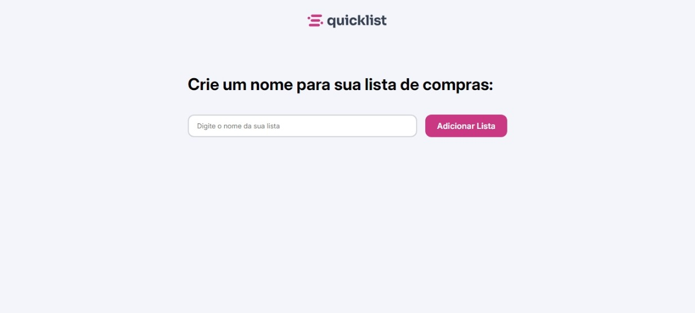

# Lista de Compras - quicklist

### 🚀 Sobre
  Aplicação de lista de compras utilizando HTML, CSS e JavaScript. Projeto inicial fornecido na formação fullstack, da Rocketseat. Algumas implementações e melhorias foram feitas por mim, em busca de ampliar conhecimentos e técnicas utilizando JavaScript.

### 🛠️ Tecnologias
- JavaScript
- CSS
- HTML

### 📷 Preview
Abaixo, imagem das duas telas da aplicação:

### 👨‍💻 Autor
- Rocketseat
- Eduardo Dias Bianchini
